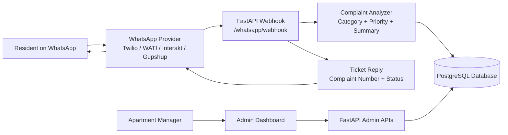
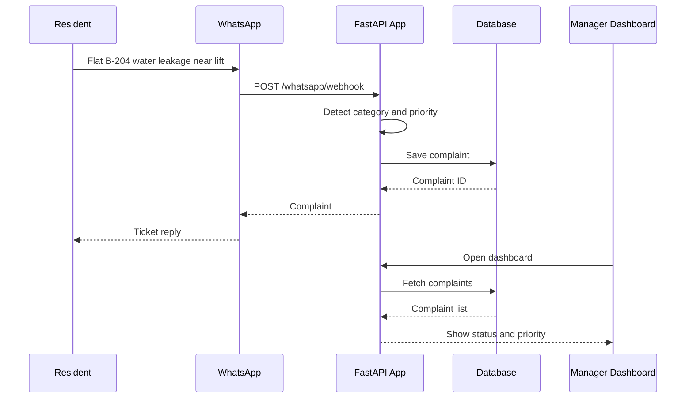
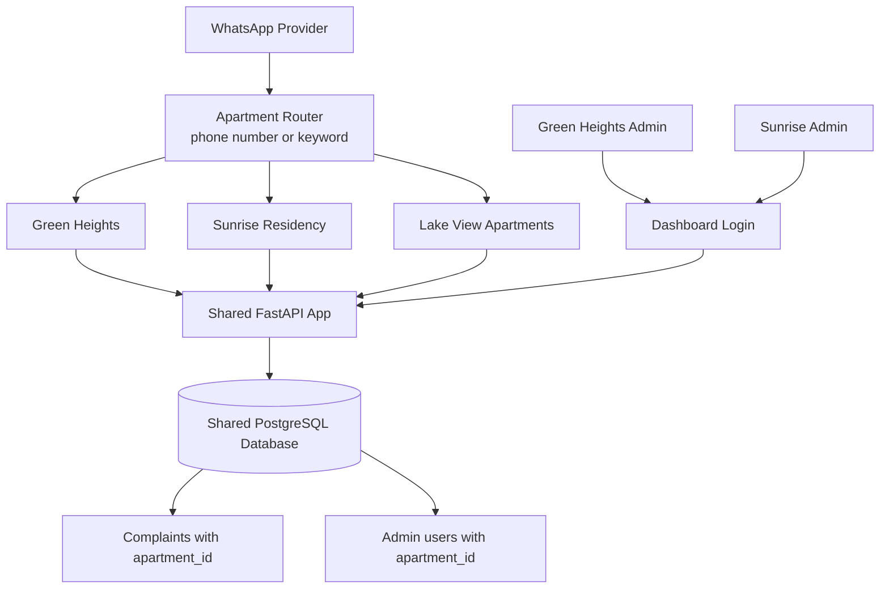

# AI Complaint Management for Apartments

A FastAPI app for apartment communities to collect resident complaints, categorize them with AI-style rules, estimate priority, generate suggested responses, and show an admin dashboard.

## Features

- Create and list complaints
- Get a complaint by ID
- Update complaint status or category
- Analyze complaint text before saving
- Dashboard for apartment management teams
- WhatsApp-style resident complaint intake
- SQLite by default for local development
- PostgreSQL through Docker Compose

## Architecture



## Complaint Flow



## Multi-Apartment Architecture



## Run Locally

```bash
python -m venv venv
source venv/bin/activate
pip install -r requirements.txt
uvicorn app.main:app --reload
```

Open `http://127.0.0.1:8000` for the dashboard.
Open `http://127.0.0.1:8000/docs` for the API docs.

Default admin login for local development:

```text
Username: admin
Password: admin123
```

For a customer deployment, set strong credentials:

```bash
export ADMIN_USERNAME=manager
export ADMIN_PASSWORD='use-a-strong-password'
```

## Run With Docker

```bash
docker compose up --build
```

## Example Request

```bash
curl -X POST http://127.0.0.1:8000/complaints/ \
  -u admin:admin123 \
  -H "Content-Type: application/json" \
  -d '{"resident_name":"Asha","message":"There is a water leak near my street and it is urgent."}'
```

## API Endpoints

- `GET /health`
- `GET /`
- `GET /dashboard/stats`
- `POST /bot/analyze`
- `POST /whatsapp/demo`
- `POST /whatsapp/webhook`
- `POST /complaints/`
- `GET /complaints/`
- `GET /complaints/{complaint_id}`
- `PATCH /complaints/{complaint_id}`
- `PATCH /complaints/{complaint_id}/category`

## WhatsApp Webhook Shape

The `/whatsapp/webhook` endpoint accepts URL-encoded WhatsApp provider payloads with fields like:

- `Body`: resident complaint text
- `ProfileName`: resident name
- `From`: resident phone number

For a real WhatsApp Business integration, point your provider webhook to `/whatsapp/webhook`.

## Test From Your Own WhatsApp

The fastest way to test is with the Twilio WhatsApp Sandbox.

1. Start the local app:

```bash
uvicorn app.main:app --reload
```

2. Expose your local app with a public HTTPS tunnel:

```bash
ngrok http 8000
```

3. Copy the HTTPS forwarding URL from ngrok and add this webhook path:

```text
https://your-ngrok-url.ngrok-free.app/whatsapp/webhook
```

4. In Twilio Console, open the WhatsApp Sandbox settings and paste that URL into:

```text
When a message comes in
```

Use `HTTP POST`.

5. Join your Twilio sandbox from WhatsApp by sending Twilio's join code to the sandbox number shown in the Twilio Console.

6. Send a complaint from WhatsApp:

```text
Flat B-204 water leakage near lift
```

You should receive a reply like:

```text
Complaint #124 has been logged as Water Supply with high priority. Status: Open.
```

Your dashboard will show the same complaint at:

```text
http://127.0.0.1:8000
```
